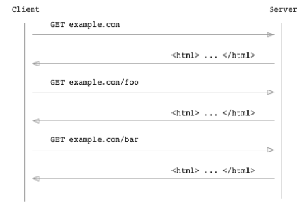
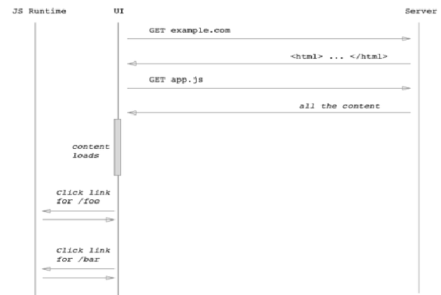
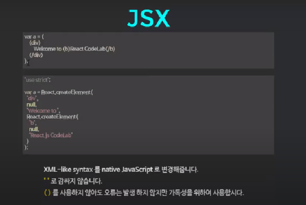

### hello

--------------------------------------
## React.js

------
<a href ="https://www.youtube.com/watch?v=BYbgopx44vo"> React and the Virtual DOM</a>

## React
유저인터페이스를 만들기 위한 라이브러리 <프레임워크x>

## 장점 
배우기 간단하고 복잡함이 없음 , 메모리관리 성능이 좋고, 
서버 & 클라이언트 렌더링을 둘 다 지원함 , 검색엔진에 최적화, UI를 간편하게 수정할 수 있고, 효율적으로 재사용이 가능, 다른 프레임워크나 라이브러리와 혼용가능 = 이미 개발된 프로그램에도 적용이 가능!

## 컴포넌트
컴포넌트(component)란 여러 개의 프로그램 함수들을 모아 하나의 특정한 기능을 수행할 수 있도록 구성한 작은 기능적 단위를 말한다

## 렌더링 
컴퓨터 프로그램을 사용하여 모델 또는 이들을 모아놓은 장면인 씬 파일(scene file)로부터 영상을 만들어내는 과정을 말한다.

## 서버 사이드 렌더링
요청시마다 새로고침이 일어나며, 서버에 새로운 페이지에 대한 요청을 하는 방식 (예를 들면 필요한물건이 생길때마다 마트에 물건을 사러 일일히 왓다갓다 하는 방식)

## Single Page Application(SPA) 구동 방식
처음에 하나의 빈 페이지만 서버측에서 제공하고, View에 대해서는 Client에서 자바스크립트를 통해 렌더링 하는 방식  == 클라이언트 렌더링

## 단점
View Only <보이는것에만 관여> = 빠진부분은 다른 라이브러리를 이용하여 구현해야함 / IE8이하 지원x

---------------
## Codepen 설정
 https://codepen.io/pen/
 
 Pen Setting의 JavaScript Preprocessor = Babel

Add External JavaScript의 구성요소로
https://npmcdn.com/react@15.3.0/dist/react.min.js 기입

https://npmcdn.com/react-dom@15.3.0/dist/react-dom.min.js 기입

react파일은 컴포넌트의 역할 / react dom은 실제 dom의 렌더링부분을 담당

-----------------
## ES6 Class 자바스크립트의 클래스
- ES6에 새로 도입된 문법

Class를 선언하기 위해서는 클래스의 이름(여기서 "Rectangle")과 함께 class 키워드를 사용해야 한다.

    class Rectangle {

        constructor(height, width) {

            this.height = height;
            this.width = width;
        }
    }

자바 스크립트 클래스 내에서는 메소드만 생성이 가능하기 때문에, 변수를 사용하기위해서는 위와 같이 이니셜라이징을 해주어야 한다.

- Initializing

    - UserInfo user = new UserInfo { ID = "yoo", PW="1234", NAME="유동훈"};

    - 클래스의 객체를 생성한 뒤 멤버변수에 값을 넣음으로서 초기화해주는 것

## 주의할 점
const p = new Rectangle();   /*   < 이곳에서 ReferenceError 가 발생   */

class Rectangle {}

위 코드와 같이 class를 정의하기 전, 클래스를 이용하여 객체를 먼저 생성해버릴 시, ReferenceError 가 발생한다. 

## Class의 표현식

Class를 정의하는 다양한 방법의 표현식이 존재한다. 이름을 가질수도 가지지 않을수도 있다.

    // 클래스의 이름이 존재하지 않을 경우
    let Rectangle = class {
    constructor(height, width) {
        this.height = height;
        this.width = width;
    }
    };
    console.log(Rectangle.name);
    // 출력: "Rectangle"
----------------------------------
    // 클래스의 이름이 존재할 경우
    let Rectangle = class Rectangle2 {
    constructor(height, width) {
        this.height = height;
        this.width = width;
    }
    };
    console.log(Rectangle.name);
    // 출력: "Rectangle2"

## extends를 통한 클래스 상속
    class Animal {
    constructor(name) {
        this.name = name;
    }

    speak() {
        console.log(`${this.name} makes a noise.`);
    }
    }

    class Dog extends Animal {
    constructor(name) {
        super(name); // super class 생성자를 호출하여 name 매개변수 전달
    }

    speak() {
        console.log(`${this.name} barks.`);
    }
    }

    let d = new Dog('Mitzie');
    d.speak(); // Mitzie barks.

위 코드는 extends를 이용하여 Animal을 상속받았듯이 우리는 Pencode에서 React.Component를 상속받는 것.

Class를 상속받아서 사용할 때 super class 생성자를 호출하여 parents의 매개변수를 전달해주는 것을 잊지말자.

----
## render 메소드

모든 React 컴포넌트에 존재하는 메소드로서, 컴포넌트가 어떻게 생길지 정의해주는 역할

----------

## JSX의 특징

자바스크립트 구성에서 html코드를 그대로 사용할 수 있다.

----
### HTML

    

### JS

    class Codelab extends React.Component{
    render(){
        return(
        
Codelab

            );
        }
    }

    class App extends React.Component{
    render(){
        return(
            <Codelab/>
            ); 
        }
    }

    ReactDOM.render(<App/>,document.getElementById('root'))

출력 : Codelab

## 주의

컴포넌트에서 여러 Element를 렌더링 할 때 꼭 container element안에 포함을 시켜주어야 한다. 예시로 위 코드처럼 < div > < /div > 안에 감싸주면 된다.

### JSX에서 자바스크립트를 표현하는 방법은 { } 로 감싸주면 된다.

    class Codelab extends React.Component{
    render(){
        let text = 'Hello I am codelab';
        return(
        
{text}

            );
        }
    }
출력문 : Hello I am codelab

## JSX에서 Style 적용하기

    class Codelab extends React.Component{
    render(){
        let text = 'Hello I am codelab';
        let color = {
        backgroundColor:'skyblue'
            };
        return(
        
{text}

            );
        }
    }
주의할 점은 기존 html처런 background-color 의 방식이 아니라는 것과 적용할 시에는 위에서 언급한 JS표현방법에 맞추어 {}안에 가두어주는 것.

## 주석달기
기존에 사용하는 방식처럼 /* .... */ 방식과 동일하되, 이 또한 { } 로 가두어 사용하고 container element안에 주석이 작성되어야 한다.

    render(){
        return(
            

            {/* H E L L O !*/}
            

        );
    }
위와 같이 < div > 에 가두어져 있을 경우 괜찮지만 div윗줄로 가거나 /div 아랫줄로 주석코드가 이동할경우 에러가 발생한다.

----
## Props
컴포넌트 내부의 변화하지 않는 데이터를 처리할 때 사용한다.

## Props의 기본 값 설정

컴포넌트의 선언이 끝난 후 defaultProps의 값을 설정하면 된다.
위 코드의 경우 value값이 0으로 지정되어 있음.

## Props의 type 검증

마찬가지로 type검증 또한 컴포넌트의 선언 이후, propTypes를 선언해주면 되는데, 위 코드의 경우, 첫 번째 value값은 string, 두 번재 value 값은 숫자, 마지막 value값은 어떤 타입이던 실수로 입력이 되도록 설정이 되 있는 모습을 볼 수 있다.

------
## State

State는 컴포넌트에서 유동적인 데이터를 보여줄 때 사용한다. 중요한점은 초기값 설정이 무조건!!! 필수적이다.

    this.state = {} 으로 설정
-------------
    this.setState({...}) 의 형태로 값을 수정
단, 렌더링 이후에는 this.state를 절대 사용해선 안된다.